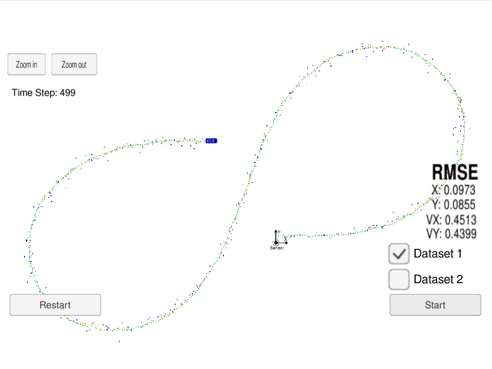

# Extended Kalman Filter Project
Goal of this project is creating Kalman filter that is able to estimate position based on inaccurate lidar and radar data by using sensor fusion.

## Algirithm

Kalman filter consist of continues loop of predicts and updates:
1. Based on motion model, Kalman filter make a prediction of it's position for current timestamp.
2. After mesurments, Kalman filter make an update of his state. 
For each sensor type this step may be diffirent, it depends on sensor's data format. 
As result we have a normal destribution, that we can use as an estimation of current position.
3. Loop 1 and 2 steps.

## Result

As result this algorithm was able to estimate position with an accuracy [0.0973, 0.0855, 0.4513, 0.4399] what is in [.11, .11, 0.52, 0.52]
